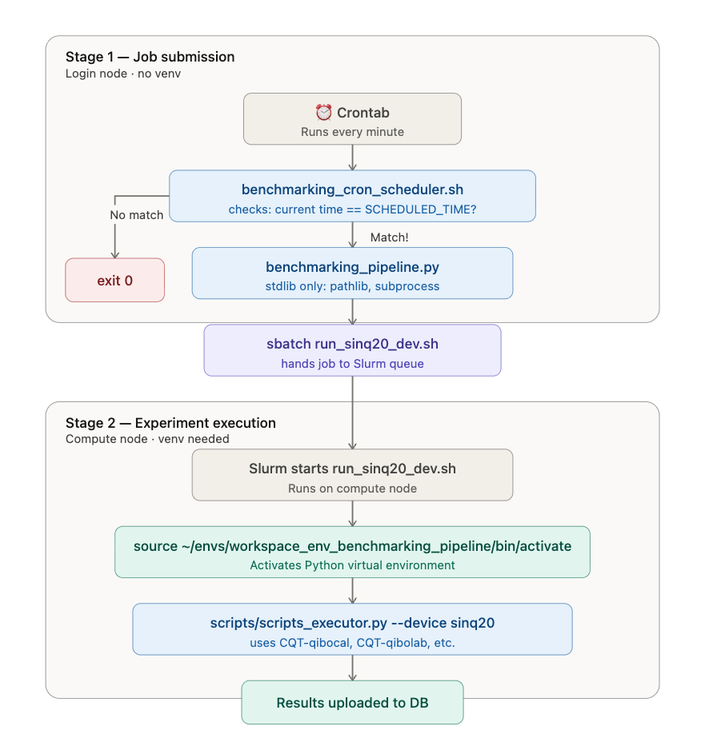

[Lab Projects](../../Lab%20Projects.md) > [Benchmarking Pipeline](../Benchmarking%20Pipeline.md)

# 1st Part: Nqch-deploy

- [Pipeline overview](#id-1stpartnqch-deploy-pipelineoverview)
- [Execution via cronjob](#id-1stpartnqch-deploy-executionviacronjob)
  - [Step 1: Crontab](#id-1stpartnqch-deploy-step1crontab)
  - [Step 2: Job submission to slurm](#id-1stpartnqch-deploy-step2jobsubmissiontoslurm)
  - [Step 3: Experiments run in a compute node](#id-1stpartnqch-deploy-step3experimentsruninacomputenode)
- [Nightly health check](#id-1stpartnqch-deploy-nightlyhealthcheck)
- [Summary Chart](#id-1stpartnqch-deploy-summarychart)

# Pipeline overview

In `cqt-paul-server` there is a user `nqch-deploy` that is used to launch slurm jobs to complete quantum experiments in the quantum computer.

This user operates the 1st part of the benchmarking pipeline which submits and runs benchmarking experiments, with results automatically uploaded to the AWS DB.

**What it does:** Every night at 21:22 SGT, a cron-triggered scheduler submits a Slurm job that runs quantum benchmarking experiments and uploads the results to the AWS Postgres DB.

# Execution via cronjob

**There are 3 stages, and they run in different environments:**

#### Step 1: Crontab

- no virtual environment needed

A crontab file in `nqch-deploy` runs `benchmarking_cron_scheduler.sh` *every minute*. The script checks if the current time matches `SCHEDULED_TIME` (currently 21:22 SGT). If it matches, it calls `benchmarking_pipeline.py`. The reason for this design is so the schedule is git-versioned and visible to the team, rather than buried in crontab syntax.

#### **Step 2: Job submission to slurm**

- no virtual environment needed

The `benchmarking_pipeline.py` script does one thing: it runs `sbatch run_sinq20_dev.sh`. That's it, it just asks Slurm to schedule a job. It only uses Python's built-in modules (`pathlib`, `subprocess`), so any system `python3` can run it. No venv, no special packages.

#### **Step 3: Experiments run in a compute node**

- yes, virtual environment needed

Later, when Slurm actually starts the job, it executes `run_sinq20_dev.sh` on a compute node. **This** **script activates the venv** (`~/envs/workspace_env_benchmarking_pipeline`), which has all the needed dependencies to execute experiments. Then it runs `scripts/scripts_executor.py`, which does the real work of running each of the experiments in `experiments_list.ini`.

**Logs & manual triggers**

Execution logs land in `/mnt/home/nqch-deploy/logs/` (e.g. `slurm_sinq20_dev_<JOBID>.out` and `.err`). Due to relative path differences between the cronjob context and the repo directory, you read them with `cat ~/logs/slurm_sinq20_dev_<JOBID>.out`.

To trigger the pipeline manually outside the normal schedule, there are two options:

(a) run `python3 ~/forks-benchmarking-pipeline/CQT-experiments/pipeline/benchmarking_pipeline.py` directly, which submits the Slurm job immediately, or

(b) temporarily edit `SCHEDULED_TIME` in `benchmarking_cron_scheduler.sh` to a few minutes from now and let the cron pick it up, then reset it to the production value after confirming it fired.

**Steps summary:**

| Stage | What runs | Where | Needs venv? |
| --- | --- | --- | --- |
| 1. Submit | `benchmarking_cron_scheduler.sh` → `benchmarking_pipeline.py` → `sbatch` | Login node | No |
| 2. Execute | `run_sinq20_dev.sh` → `scripts_executor.py` | Compute node (Slurm) | Yes (activates it itself) |

The venv is only needed for stage 2, and stage 2 activates it directly on its own. Therefore, you never need to manually activate anything to trigger the pipeline.

# Nightly health check

A separate cron-triggered script monitors whether the pipeline ran successfully each night.

**What it does:** Every night at 23:50 SGT, `check_experiments_submission.sh` (in `pipeline/checks/`) verifies two things:

1. **Did a Slurm job run today?** — checks if a `slurm_sinq20_dev_*.out` file was produced with today's date.
2. **Did it complete without errors?** — checks if the most recent `.err` file is non-empty (> 10 bytes).

If either check fails, a Slack notification is sent with a description of the problem and the relevant log contents. If both pass, a success confirmation is posted.

**How it runs:** Same pattern as `benchmarking_cron_scheduler.sh` — crontab fires the script every minute, and the script only acts when the current time matches `SCHEDULED_TIME` (currently `23:50`). The schedule is git-versioned in the script, not in the crontab.

**Configuration:** Requires `SLACK_NOTIFICATIONS_WEBHOOK` set in `~/.env_user`.

| What | Path | Server |
| --- | --- | --- |
| Health check script | `~/forks-benchmarking-pipeline/CQT-experiments/pipeline/checks/check_experiments_submission.sh` | cqt-paul-server |

# Summary Chart

