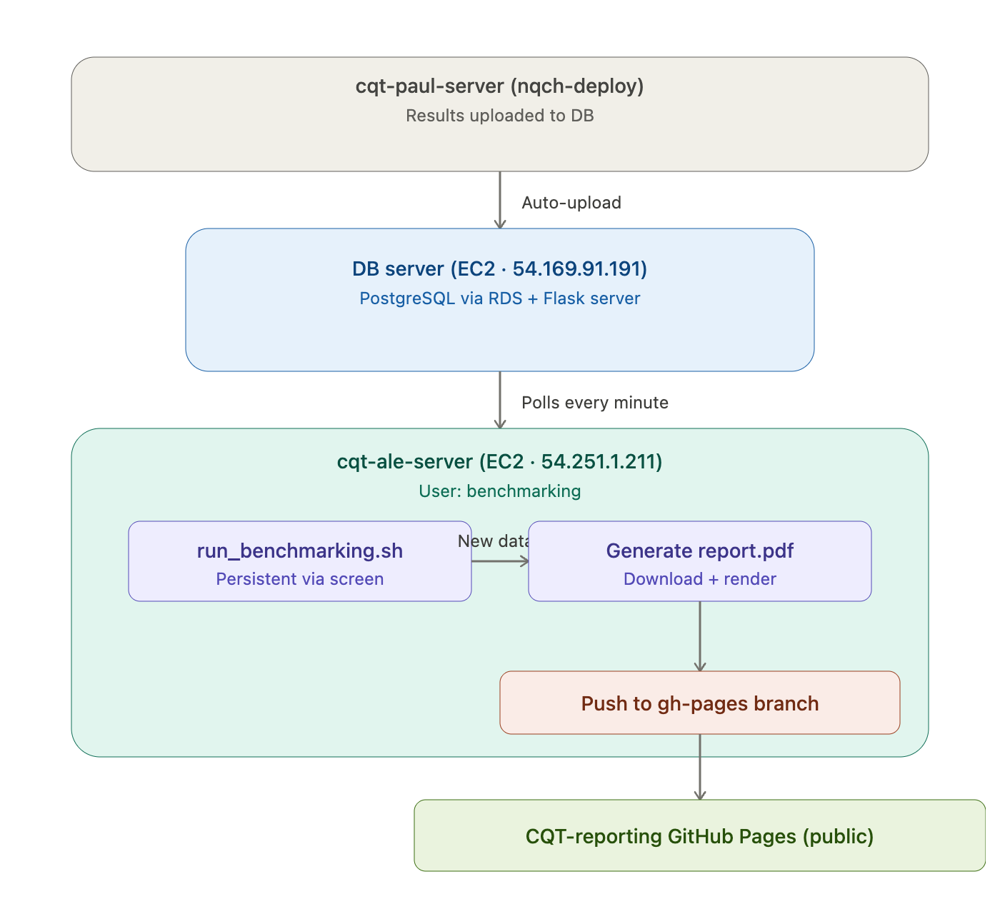

[Lab Projects](../../Lab%20Projects.md) > [Benchmarking Pipeline](../Benchmarking%20Pipeline.md)

# 2nd Part: AWS

# Pipeline overview

Experiments for benchmarking run in `cqt-paul-server` (see server nicknames in page [Servers](../../Infra/Servers.md)). Benchmarking experiments generate results that are automatically uploaded from user `nqch-deploy` in `cqt-paul-server` to a Data Base (known as [AWS Data Base](../../Infra/AWS/AWS%20Data%20Base.md)) which lives in AWS. In particular, the DB is a postgresql DB created via RDS and there’s an exclusive EC2 instance that hosts the DB flask server and client. Also in AWS, there’s another EC2 instance different from that of the DB . In there, there’s a dedicated user named `benchmarking`. This user is in charge of polling the database every minute to know if new data has been uploaded. The polling runs persistently in the background uninterrupted “forever”. This means when new data is detected, it is automatically downloaded and a new `report.pdf` is generated. This `report.pdf` then gets pushed to the github page in branch `gh-page` of repo `CQT-reporting` (Scinawa) so that every new `report.pdf` is available automatically to the wider public.

The following commands explain how to run the script `run_benchmarking.sh` ***persistently*** in `cqt-ale-server` from user `benchmarking`.

# Running `run_benchmarking.sh` persistently with `screen`

### Start it (do this once)

```java
screen -S benchmarking -L -Logfile /home/benchmarking/benchmarking.log bash -c '/home/benchmarking/run_benchmarking.sh'
```

This starts a named session called `benchmarking` and logs all output to `/home/benchmarking/benchmarking.log`.

### Detach without killing it

```java
Ctrl+A  then  D
```

The script keeps running in the background. You can now close your SSH connection safely.

### Reattach to see live output

```java
screen -r benchmarking
```

### Verify it is running

```java
screen -ls
```

You should see something like `benchmarking (Detached)`.

### Check the log from anywhere

```java
tail -f /home/benchmarking/benchmarking.log
```

`Ctrl+C` to stop watching (does NOT stop the script).

### Stop the script (when you intentionally want to kill it)

```java
screen -r benchmarking
# then Ctrl+C to stop the script
# then type: exit
```

**One important caveat:** `screen` does NOT survive a server reboot. If the server restarts, you'll need to run the start command again.

# Summary Chart


