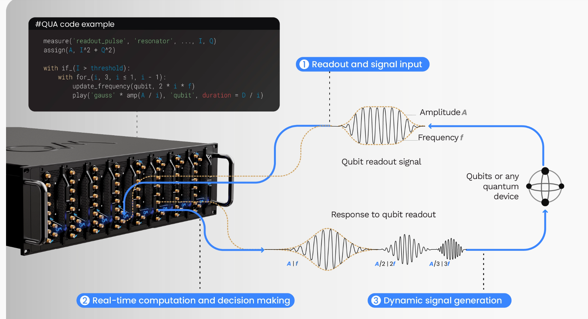

[Lab Projects](../../Lab%20Projects.md) > [Conditional Operations](../Conditional%20Operations.md)

# Documentation

- [Qblox](#documentation-qblox)
- [Qiskit](#documentation-qiskit)

# Qblox

<https://docs.qblox.com/en/main/autoapi/qblox_scheduler/operations/index.html#qblox_scheduler.operations.ConditionalOperation>

# Qiskit

<https://quantum.cloud.ibm.com/docs/en/guides/execute-dynamic-circuits>
