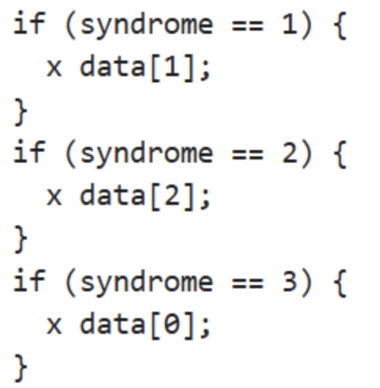

[Lab Projects](../../Lab%20Projects.md) > [Conditional Operations](../Conditional%20Operations.md)

# Kick-off

# Examples of mid-circuit mesurement & classical conditioning transpiled to OpenQASM 3:

## **Sample Notebook**

[Executing dynamic circuits in python OpenQASM3.ipynb](../../../attachments/c049a4de-c2de-48e1-a840-2e341858d5f1.txt)

> [!NOTE]
> To run the code, you need to have `qiskit` and `qiskit-qasm3-import` installed (both are easy to install with `pip install`).

The circuits created are:

- a) Mid-circuit measurement without conditioning
- b) Mid-circuit measurement with conditioning
- c) Quantum Teleportation protocol
- d) 3-bit repetition code bit-flip correction.

All circuits are plotted, so you can see their shape.

The reason for adding the 3-bit repetition code is that in this case there is a condition where, if both measured classical bits are 1, a specific gate is executed.

Of the 4 circuits, only (a) uses the new method added in Qiskit, `MidCircuitMeasurement()`.   
Since it is new, it is not available for transpilation to OpenQASM 3, and it throws an error.   
For the rest of the circuits, the original `measure()` method is used, which essentially works the same way and does allow compilation.

To implement the classical logic and condition the gates, no separate operations are performed.  
The conditionals are defined like a truth table, taking into account the entire classical register when evaluating the conditions. In summary, OpenQASM 3 also has an 'if'-type structure implemented.

