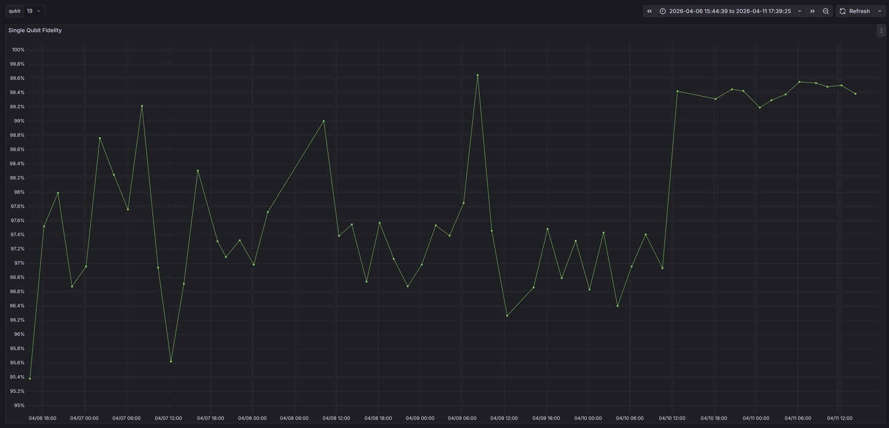
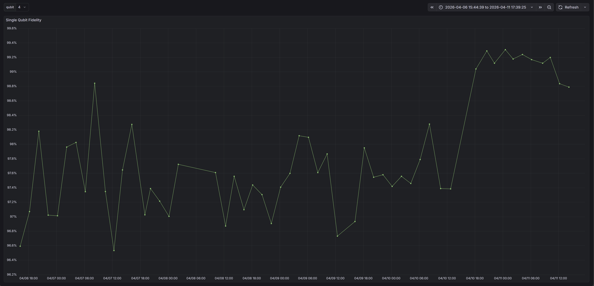

[Meetings](../../Meetings.md) > [13/04/2026](../13_04_2026.md)

# 13/04/2026 (HW team slides)

**Facilities Status**

- Cooling water temperature rising since 11.15AM

**Autocalibration**

- Prototype module that will perform simple/coarse single qubit gate recalibration of failing qubits
- New platform will be pushed to Github for manual review before merging
- Currently updating of local platform is manual, but will be handled by webhooks in the future

**Autocalibration Results**

**Qibo Updates**

Qibolab

- Pushing Keysight driver changes (PR #1420, WIP on review changes)

Qibocal

- Updating 1Q randomized benchmarking for Qibocal RB rework (WIP)
- Tested existing RB batched changes on new Qibolab driver
- Pushing parallel 2Q benchmarking (PR #1416, draft)

**Bimonthly Forecast**

**April**

- Keysight update – Full 20Q readout, potentially DRAG fix
- Starting readout shelving to improve readout fidelity
- Starting phase error amplification to improve 2Q fidelity
- Coarse autocalibration rollout

**May**

- IHPC/NQCH Qibosoq collaboration with 5Q QPU

**June/July**

- Qblox demonstration with 5Q QPU
